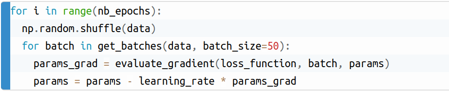

## Notes to select optimizers for your Deep Learning models based on ![[1]](https://ruder.io/optimizing-gradient-descent/index.html)

### Introduction:

1) A function is approximated by a model after training.
2) To determine how good a fit is, loss function is used.
3) When the model and loss function are combined we get an optimization problem.
4) Objective function is a loss function in which the model is plugged in i.e., it is parameterized by model parameters.
5) Optimization involves minimizing an objective/cost function with respect to model parameters.
6) Gradient descent is used to optimize neural networks.
7) A gradient is obtained by differentiating(calculus) the objective function with respect to the parameters.
8) Minimization means to update the parameters in the opposite direction of the gradient.
9) Learning rate is the size of the step taken to reach a global/local minima.

``Some properties of Deep Networks:``

`There will be more local mimimas for deeper models.`

`The effect of changes in parameters gets amplified.`

### SGD(Stochastic Gradient Descent):

1) SGD iteratively updates the gradients by calculating it for one example at a time.
2) It is fast and can be used for online learning.
3) In mini-batch gradient descent, instead of iterating over each examples, the gradient is calculated on a batch size of n.

 

4) Frequent updates with high variance result in high fluctuations.
5) Fluctuations result in jumping from one local minima to the other complicating convergence.
6) But, it is shown that when the learning rate is decreased slowly, it converges to local or global minima.
7) Usually when SGD is mentioned, it means SGD using mini-batches.

### Challenges posed by SGD:

1) It is difficult to choose a proper learning rate.
2) Learning rate can be reduced according to a pre-defined schedule or depending upon when the change in the objective between epochs falls below a threshold. These schedules and thresholds have to be defined in advance and wont adapt to dataset’s characteristics.
3) The same learning rate is applied to all parameters.
4) Escaping from suboptimal local minima and saddle points traps.

### Momentum:

1) Accelerates SGD in the appropriate direction and also reduces oscillations.

### NAG(Nesterov accelerated gradient):

1) NAG is is better than Momentum.
2) The anticipatory NAG update prevents us from going too fast and results in increased responsiveness.
3) Updates are adapted to the slope of the error function and results in more speed than SGD.

### Adagrad:

1) Has per parameter learning rate and uses low learning rates for high frequency features and high learning rates for low frequency features.
2) Suitable for dealing with sparse data.
3) No manual tuning of learning rates is required.
4) Default learning rate is 0.01
5) Learning rate of this algorithm shrinks.

Note: if the learning rate is infinitesimally small, the algorithm cannot learn.
### Adadelta:

1) This is an extension of Adagrad that seeks to reduce its aggressive, diminishing learning rate.
2) No need to set a default learning rate.

### RMSprop:

1) Solves Adagrad’s radically diminishing learning rates.
2) Suggested default values: Momentum, γ = 0.9, learning rate, η = 0.001.

### Adam(Adaptive Moment Estimation):

1) Adam is another method that computes adaptive learning rates for each parameter.
2) Adam can be viewed as a combination of RMSprop and momentum.
3) Default values are 0.9 for β1, 0.999 for β2, and 10−8 for ϵ.

### Adamax:

1) Updates are more stable as infinity norm is used.
2) Default values are η=0.002, β1=0.9, and β2=0.999.

### Nadam(Nesterov-accelerated Adaptive Moment Estimation):

1) Nadam combines Adam and NAG.

### AMSGrad:

1) Adaptive learning rate methods in some cases are outperformed by SGD with momentum.
2) The solution of Adaptive learning rate methods has the following disadvantages: a) Diminishes the influence of large and informative gradients which leads to poor convergence. b) Results in short-term memory of the gradients which becomes an obstacle in other scenarios.
3) Because of the above reasons, the following algorithms have poor generalization behaviour: Adadelta, RMSprop, Adam, and Nadam
4) AMSGrad results in a non-increasing step size, which results in good generalization behavior.

### Additional Strategies for optimizing SGD:
#### Shuffling and Curriculum Learning:

1) Generally giving to the model the training examples in an order may bias the optimization algorithm. But, sometimes you have to shuffle the training data after every epoch to get good results.
2) Also, giving the model the training examples in an order might help in some cases and this order establishment is called curriculum learning.

#### Batch normalization:

1) For the learning to be good normalize the initial values of the parameters by initializing them with zero mean and unit variance.
2) As training progresses the initial normalization is lost resulting in slowing down of training.
3) Batch normalization resets normalization of parameters for every mini-batch.
4) If normalization is used in the model itself, we can use higher learning rates and not worry about parameter initialization.

#### Early stopping:

1) Stop when your validation error does not improve enough.

#### Gradient noise:

1) Adding noise makes networks more robust to poor initialization.
2) Helps training deep and complex networks in particular.
3) This added noise might give the model more chances to escape and find new local minima.

### References:

1. 

2. 

3. Lecture notes from : 
