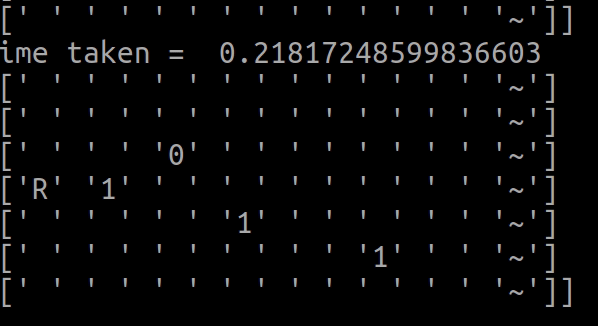
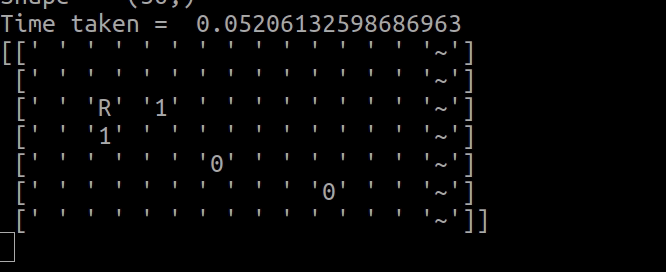

## Just another DeepRL Rock Sampler program ready for tuning


### Please NOTE!! I found a similar solved problem at https://www.samyzaf.com/ML/tdf/tdf.html

Reinforcement Learning is nothing but an agent learning in a loop after getting a reward for its action in an environment. And the agent learns a particular function which maps observations(of the environment) to actions in this process. This function is learned using deep learning in Deep Reinforcement Learning(DeepRL).

I thought of getting some understanding about DeepRL by working on a sample program and came across a  which is about a rover picking up 1s and avoiding 0s. The actual program has a MCTS(Monte Carlo Tree Search) implementation and its output looks like this:



To train it as  using DeepRL and explained it in the  and to keep it simple,  which uses keras is used.

One of the models performed like this(you can see it picks up 0s and also ignores 1s):



The features given to the model are verified thoroughly. I consider the input data as sparse. Work can be done by changing:
1) preprocessing of inputs 
2) preprocessing of discounted rewards 
3) gamma of discounted rewards 
4) number of units in layer1 and layer2 
5) activation functions 
6) learning rate 
7) optimizers

I am thinking for now, not to poke around with kernel and bias initializers.

Some of the parameters that need to be tuned can be set in  file:

```
        krnl_init = keras.initializers.RandomNormal(mean = 0.0, 
                    stddev = 0.05, seed = 121)
        bias_init = keras.initializers.Zeros()
        l1_units = 200
        l2_units = 20
        activ = 'relu'
        lrn_rt = 1.0e-6

        # RMSprop optimizer

        #opt = keras.optimizers.RMSprop(
        #    learning_rate = lrn_rt, rho = 0.9, momentum = 0.0, 
        # epsilon = 1e-07, centered = False, name = 'RMSprop')

        # Adadelta optimizer
        #opt = keras.optimizers.Adadelta(
        #    lr = lrn_rt, rho = 0.95, epsilon = 1e-07)

        # Adam w/wo amsgrad
        # opt = keras.optimizers.Adam(lr = lrn_rt, amsgrad=True)

        # Adagrad
        #opt = keras.optimizers.Adagrad(learning_rate=lrn_rt,
        #     initial_accumulator_value=0.1, epsilon=1e-07,
        #    name='Adagrad')

        # Nadam
        opt = keras.optimizers.Nadam(
            lr=lrn_rt, beta_1=0.9, beta_2=0.999, 
            epsilon=1e-07, name = 'nadam')
```        
The articles and documents that I found to be really helpful are ,  on optimizing gradient descent along with inspiring karpathy's article , and karpathy's .

Still working on hyperparameter tuning so as to get a good model...()

### Running the program
The files to run are in the  directory:

To train the model:
`python rock_train.py`

To see how the latest model is working:
`python rock_model_demo_latest.py`

To test the models(Still in development):
`python rock_model_test.py`
